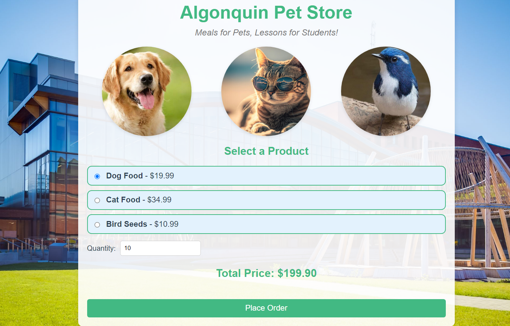
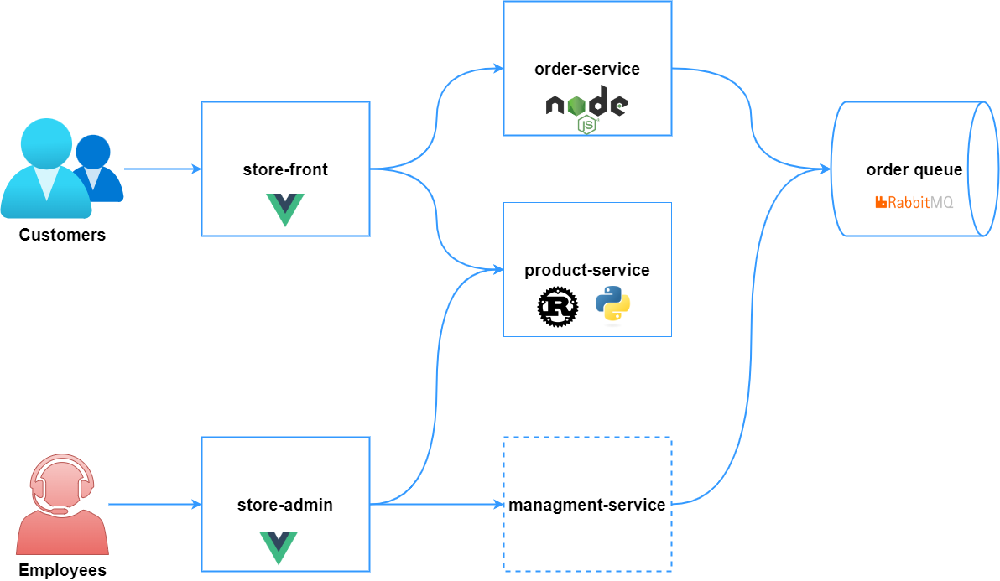

# Lab Project Assignment #1: Create and Integrate the `management-service` with `store-admin` in Algonquin Pet Store app

[Algonquin Pet Store](https://github.com/ramymohamed10/algonquin-pet-store) is a full-stack web application. It consists of a Vue.js store-front, Node.js order-service, Rust-based product-service, and RabbitMQ for message brokering. These components work together to create a microservices architecture.

## Scenario:
Another team has developed the `store-admin` Web app, a Vue.js application that can be used by store employees to view customer orders in the queue. The `store-admin` app is now part of the [Algonquin Pet Store](https://github.com/ramymohamed10/algonquin-pet-store) system and is designed for internal use by store staff. It connects with backend services, such as `product-service` to display information about products. Additionally, the `store-admin` app needs to display information about orders. This require the creation of a new backend service called `management-service`.

You have been assigned the task of creating the `management-service` that will get order messages from RabbitMQ and serve it to the `store-admin` Web app.

## Your Tasks:

### 1. Create the `management-service` (Use a suitable programming language):

The `management-service` must:
- Get order messages from RabbitMQ.
- Expose a REST API that the `store-admin` Web app can use to view orders.

You must include a `.http` file to allow other teams to easily test the API endpoints using VS Code’s built-in `REST client`. 

### 2. Comply with first four factors of 12-Factor principles:

`management-service` must comply with the first four factors of the [**12-Factor App**](https://12factor.net/): **Codebase**, **Dependencies**, **Configuration**, and **Backing Services**.

### 3. Deploy the Service to Azure Web App Service:

- Deploy the `management-service` **directly from code** to Azure Web App Service.
- Ensure that the service is accessible and can retrieve orders from RabbitMQ deployed on an Azure VM.
- **After deployment**, **delete** the Azure resources (to minimize costs) but keep the .github/workflows folder in your GitHub repository to verify deployment success through GitHub Actions (**Very Important**).

## Submission Requirements

### 1. `management-service` Service Repository:
You must create a new **PRIVATE GitHub repository** for your **`management-service`**. Ensure that the repository contains the following:

- **README.md**:
  - Document the service’s functionality, setup instructions, and API endpoints.
  - Include deployment instructions and integration details with RabbitMQ.
  - Explain how to run and test the service locally.

- **.gitignore**:
  - Ensure that sensitive files (like `.env`) are excluded from the repository.

- **Service Code**:
  - Your code should be organized and documented using comments.
  
- **.http File**:
  - Include an `.http` file that contains sample API test requests. This file should allow easy testing of your service’s API endpoints using VS Code’s REST client.

### 2. Deleting Azure Resources:
- After you have successfully deployed the service to **Azure Web App Service**, **delete the Azure resources** (to minimize costs). 
- **Keep the `.github/workflows` folder** in the GitHub repository. This folder will contain the CI/CD pipeline configuration that was used to deploy the service, allowing the instructor to verify the deployment through GitHub Actions.

## Submission:
- **Due Date:** Submit the GitHub repository link via **Brightspace** by **[18 October 2024]**.
- **GitHub Repository Access:** **You must** make your repository **private** and **add instructor as a collaborator**.
  - Instructure username: `ramymohamed10`
  - Refer to this guide: [Inviting collaborators to a personal repository](https://docs.github.com/en/enterprise-server@3.10/account-and-profile/setting-up-and-managing-your-personal-account-on-github/managing-access-to-your-personal-repositories/inviting-collaborators-to-a-personal-repository
  )

## Grading Criteria

| **Component**                        | **Weight** |
|--------------------------------------|------------|
| **`Management-Service` Implementation**: Integration with RabbitMQ, API development, and compliance with first four factors of 12-Factor principles. | **50%** |
| **API Design and Documentation**: Clear, well-documented API endpoints, `.http` file for testing | **25%** |
| **CI/CD Deployment Configuration**: Functional CI/CD pipeline in `.github/workflows`, automatic deployment to Azure | **25%** |

---

## Important Information (Must Read)

### Regular Commits and Version Control
It is highly recommended that you commit your work to your GitHub repository **periodically**. Use **meaningful commit messages** to describe the purpose of each commit. This will help you track your progress and ensure you have a backup of your work.

### Late Assignments
Assignments are due on the date and time specified by the course professor. Assignments **not submitted on time** will incur a **10% deduction per day**. After **5 days**, a **zero** will be assigned. Ensure that your assignments are clearly written, complete, and adhere to College standards to reflect a professional image.
> **Note:** Any changes made to your submission GitHub repository **after the deadline** will be **ignored**. Only the state of the repository at the time of the deadline will be considered for grading.

### Academic Integrity
As a learner, you are expected to follow Algonquin College’s **Academic Integrity Policy AA48**. If academic misconduct is suspected, it will be reported to the Academic Integrity Manager. This could result in a zero on the assignment or more severe academic sanctions.

### Permitted Use of AI Tools
You are allowed to use generative AI tools (e.g., ChatGPT, GitHub Copilot) to **assist** with brainstorming, drafting, coding, or problem-solving, provided that their use is fully disclosed and appropriately cited.

#### Requirements:
- **Transparency:** If you use generative AI in your submissions, you must disclose how it was used and cite it properly. For example, if AI helped draft part of your work, mention that in the `README.md` file of your repo.
- **Original Thought:** The work submitted must primarily reflect your own understanding and effort. AI-generated content should be integrated and modified by you.
- **Critical Evaluation:** You are responsible for verifying the accuracy and relevance of AI-generated content. Do not accept AI suggestions at face value without proper validation.

#### Academic Integrity:
- **Prohibited Use:** Directly submitting AI-generated work without modification, evaluation, or citation is considered a violation of academic integrity under Algonquin College’s Policy AA48. This is similar to contract cheating.
- **Consequences:** Violations of this policy could result in a zero on the assignment or other disciplinary actions as outlined in the college’s academic integrity policy.

### Collaboration and Individual Work
This assignment must be completed **individually**. Any collaboration with other students or any external person is considered a violation of **academic integrity** under Algonquin College Policy. All work submitted must be your own.
